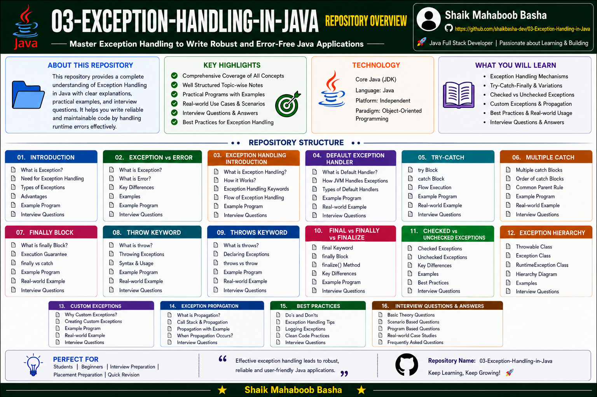

# Java Exception Handling

## Overview

This repository contains comprehensive notes, examples, and interview preparation materials on **Exception Handling in Java**.

The content is organized from basic to advanced concepts and includes:

* Exception fundamentals
* Exception Handling using try-catch-finally
* Checked and Unchecked Exceptions
* throw and throws keywords
* Exception Hierarchy
* Custom Exceptions
* Exception Propagation
* Best Practices
* Interview Questions and Answers

Each topic contains theory, examples, explanations, outputs, important points, and interview-oriented content to help learners build a strong understanding of Java Exception Handling.

## Repository Overview

## Repository Structure

### 01 - Introduction to Exceptions in Java

This section introduces exceptions and explains why exception handling is important in Java applications.

Topics Covered:

* What is an Exception
* Importance of Exceptions
* Types of Exceptions
* Checked Exceptions
* Unchecked Exceptions
* Errors
* Basic Exception Handling Syntax
* Important Exception Keywords
* Example Programs

### 02 - Exception vs Error in Java

This section explains the differences between exceptions and errors in Java.

Topics Covered:

* Exception Definition
* Error Definition
* Differences between Exception and Error
* Recoverable vs Non-Recoverable Problems
* Examples and Comparison

### 03 - Exception Handling Introduction in Java

This section introduces the Java Exception Handling mechanism and its core blocks.

Topics Covered:

* What is Exception Handling
* Why Exception Handling is Needed
* try Block
* catch Block
* finally Block
* Basic Syntax
* Example Programs

### 04 - Default Exception Handler in Java

This section explains how the JVM handles uncaught exceptions using the default exception handler.

Topics Covered:

* Java Default Exception Handler
* Stack Trace
* Uncaught Exceptions
* ArithmeticException Example
* Program Termination
* Importance of Custom Exception Handling

### 05 - Try-Catch Block in Exception Handling

This section explains how to identify and handle exceptions using try-catch blocks.

Topics Covered:

* try-catch Fundamentals
* Handling ArithmeticException
* Handling Array Exceptions
* User Input Validation
* Multiple Examples
* Pseudocode
* Detailed Line-by-Line Explanations

### 06 - Multiple Catch Block in Java

This section covers handling different exception types using multiple catch blocks.

Topics Covered:

* Multiple catch Blocks
* Handling Different Exceptions Separately
* InputMismatchException
* ArithmeticException
* Best Practices for Catch Ordering

### 07 - finally Block in Java

This section explains the finally block and its role in cleanup operations.

Topics Covered:

* finally Block
* Resource Cleanup
* File Handling Cleanup
* finally with Exception
* finally without Exception
* Real-world Examples

### 08 - throw Keyword in Java

This section explains how to manually throw exceptions using the throw keyword.

Topics Covered:

* throw Keyword
* Manually Throwing Exceptions
* Validation Examples
* IllegalArgumentException
* Custom Error Messages
* throw with try-catch

### 09 - throws Keyword in Java

This section explains exception declaration and caller responsibility using the throws keyword.

Topics Covered:

* throws Declaration
* Checked Exceptions
* IOException Examples
* Multiple Exception Declarations
* Caller Responsibility
* throw vs throws

### 10 - final vs finally vs finalize

This section explains the differences between final, finally, and finalize in Java.

Topics Covered:

* final Keyword
* finally Block
* finalize() Method
* Differences and Comparison Table
* Example Program
* Modern Java Recommendations

### 11 - Checked and Unchecked Exceptions

This section explains the classification of checked and unchecked exceptions.

Topics Covered:

* Checked Exceptions
* Unchecked Exceptions
* Compile-time Exceptions
* Runtime Exceptions
* File Handling Examples
* ArithmeticException Examples

### 12 - Exception Hierarchy in Java

This section explains the Java exception class hierarchy and important relationships.

Topics Covered:

* Throwable Class
* Error Hierarchy
* Exception Hierarchy
* RuntimeException
* Checked Exception Hierarchy
* Important Relationships

### 13 - Custom Exceptions in Java

This section explains how to create user-defined exceptions for application-specific requirements.

Topics Covered:

* User Defined Exceptions
* Creating Custom Exceptions
* Extending Exception Class
* Business Logic Exceptions
* Custom Validation Examples

### 14 - Exception Propagation in Java

This section explains how exceptions propagate through the Java method call stack.

Topics Covered:

* Exception Propagation
* Call Stack Flow
* Exception Passing Between Methods
* Handling Exceptions at Different Levels
* Real Examples

### 15 - Exception Handling Best Practices

This section covers professional and industry-oriented Exception Handling practices.

Topics Covered:

* Catch Specific Exceptions
* Use Meaningful Messages
* Try-with-Resources
* Resource Management
* Logging Exceptions
* Avoid Empty catch Blocks
* Professional Coding Practices

### 16 - Exception Handling Interview Questions and Answers

This section contains interview-oriented questions covering important Java Exception Handling concepts.

Topics Covered:

* Frequently Asked Interview Questions
* Checked vs Unchecked Exceptions
* throw vs throws
* Exception Hierarchy
* Custom Exceptions
* try-catch-finally
* Exception Propagation
* Best Practices
* Real Interview Examples

## Features of This Repository

This repository provides:

* Beginner to advanced Exception Handling concepts
* Well-structured learning path
* Detailed theory notes
* Java programs with explanations
* Output for every program
* Pseudocode and flow explanations
* Real-world exception examples
* Industry-oriented best practices
* Interview questions and answers
* Suitable for revision and technical interviews

## Technologies Used

* Java
* Exception Handling
* Object-Oriented Programming
* Git
* GitHub
* Markdown

## Interview Preparation

Interview questions and answers cover:

* Exception fundamentals
* Exception vs Error
* try-catch-finally
* Multiple catch blocks
* throw and throws
* Checked and Unchecked Exceptions
* Exception Hierarchy
* Custom Exceptions
* Exception Propagation
* Exception Handling Best Practices

The interview preparation content is structured to strengthen conceptual understanding and support Java technical interview preparation.

## Purpose

This repository is created to:

* Build strong Exception Handling concepts in Java
* Understand runtime error management
* Learn industry-standard exception handling techniques
* Practice exception handling through Java programs
* Prepare for Java technical interviews
* Maintain structured Java learning notes
* Support quick revision and placement preparation

## Repository Highlights

* 16 structured Exception Handling sections
* Theory, programs, and output
* Real-world examples
* Pseudocode and flow explanations
* Professional Exception Handling best practices
* Interview questions and answers
* Beginner-friendly learning structure
* Interview-oriented content

## Who Can Use This Repository

This repository is useful for:

* Beginners learning Java Exception Handling
* Java students
* College students
* Freshers preparing for technical interviews
* Placement preparation
* Java interview preparation
* Developers revising Exception Handling concepts

## Author

**Shaik Mahaboob Basha**

B.Tech - Electronics and Communication Engineering

Aspiring Java Full Stack Developer

## Future Improvements

Additional advanced topics may include:

* Try-with-Resources Deep Dive
* Chained Exceptions
* Suppressed Exceptions
* Logging Frameworks and Exception Handling
* Exception Handling in JDBC
* Exception Handling in Multithreading
* Custom Runtime Exceptions

## Support

If this repository helps you in your learning journey, interview preparation, or future reference, please consider giving it a **Star ⭐**. Your support is greatly appreciated and motivates me to continue creating high-quality educational repositories.

## Conclusion

This repository is created as a comprehensive Java Exception Handling learning and interview preparation resource. It contains exception handling concepts, practical programs, detailed explanations, real-world examples, best practices, and interview questions arranged in a structured manner for easy learning, revision, and technical interview preparation.

Happy Learning and Keep Coding!
